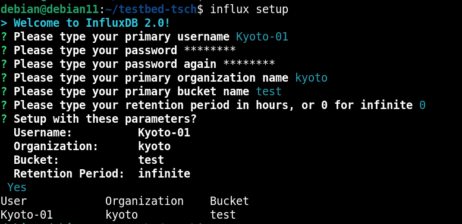

# Testbed TSCH - Primeiros passos (Configuração do ambiente de desenvolvimento e execução)

## Pré-requisitos

* git

## Instalação dos módulos do testbed e suas dependências

* Baixe o repositório principal do Testbed TSCH para o diretório home do usuário:

```
cd ~
```

```
git clone https://github.com/Kyoto-01/testbed-tsch.git
```

**_OBS_**: Caso opte por baixar o repositório em algum outro local, deverá modificar a variável `PROJ_DIR` no módulo Build Tool, localizado em `testbed-tsch-firmware/tools/testbed-build`.

* Entre no repositório baixado e execute o script de setup do Testbed TSCH:

```
cd testbed-tsch/
```

```
source setup.sh
```

## Configuração do InfluxDB

* Execute o comando de setup do InfluxDB:

```
influx setup
```

* Responda as perguntas que irão aparecer no terminal. O resultado se parecerá com o seguinte:



* Copie o token de API do InfluxDB (Irá precisar dele nos passos seguintes):

```
influx auth list | cut -f 3 | tail -n1
```

## Configuração dos módulos do Testbed TSCH

### Configuração do módulo Serial Reader

* Entre no repositório do módulo Serial Reader e crie um arquivo de configuração à partir do template `config.example.ini`:

```
cd testbed-tsch-serial-reader/
```

```
cp config.example.ini config.ini
```

* Preencha da seguinte maneira o arquivo de configuração criado:

```ini
[influx2]
url=http://<address>:<port>
org=<organization>
token=<token>
```

Onde: 

* **url**: URL formada pelo endereço (configure `localhost` por padrão) e porta (configure `8086` por padrão) nos quais a API do InfluxDB ouve.

* **org**: Organização que foi configurada no InfluxDB.

* **token**: Token de API do InfluxDB.

### Configuração do módulo Control Entity

* Entre no repositório do módulo Control Entity e crie um arquivo de configuração à partir do template `config.example.ini`:

```
cd testbed-tsch-control-entity/
```

```
cp config.example.ini config.ini
```

* Preencha da seguinte maneira o arquivo de configuração criado:

```ini
[broker]
addr=<address>
port=<port>
queue=<queue>
```

Onde: 

* **addr**: Endereço do broker RabbitMQ (configure `localhost` por padrão).

* **port**: Porta do broker RabbitMQ (configure `5672` por padrão).

* **queue**: Fila do broker da qual o módulo receberá mensagens (configure `testbed-control` por padrão).
